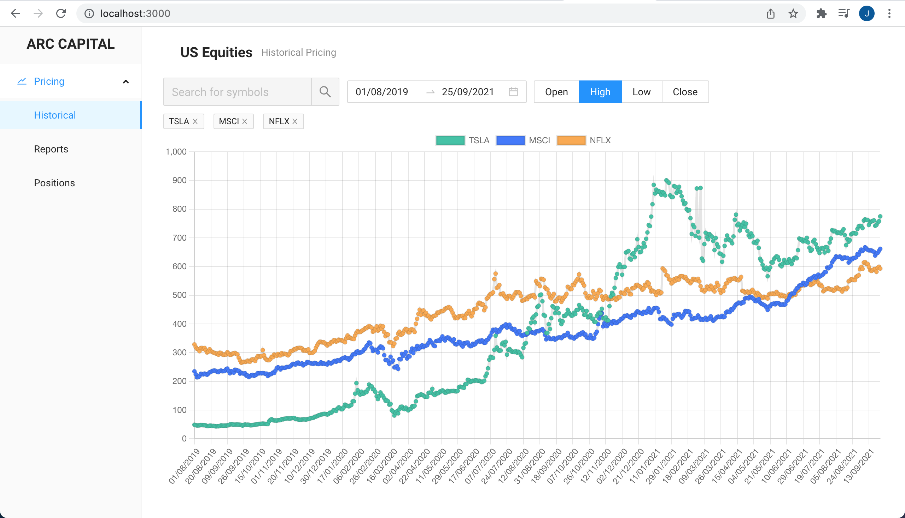

# AntD, React, Redux, Charting App integrating with FinHub for market data.

    

## Architecture Points:

    1) The Filters component uses redux state with the idea that other UI components can subscribe to filters for something like a dashboard. The Equities component handles its local state for chart data that does not need to be shared with other parts of the application.

    2) Some complexity can be removed if the API were to return chart data for multiple series at a time. For example, a single call to '/stock/candle' vs waiting for multiple promises to complete with the chart data.

    3) NOTE: FINNHUB_API_KEY needs to be set as an env.

### To run the application

    `npm install -g serve`
    `serve -s build`
    `go to http://localhost:3000`

### To develop

    `npm install`
    `npm run start`

### To build

    `npm install`
    `npm run build`